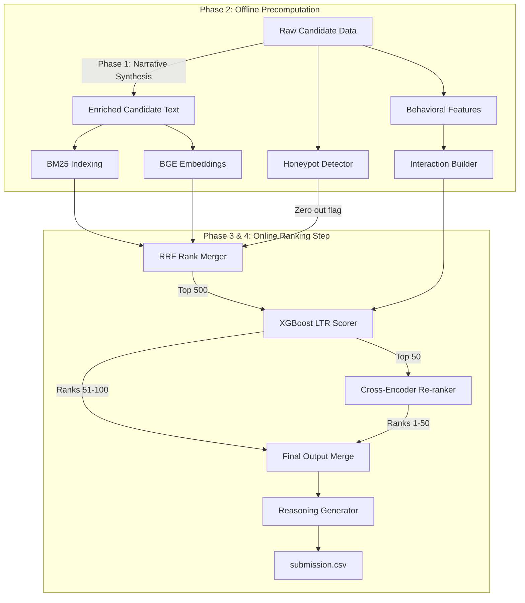

# Candidate Enrichment & Deep Ranking Pipeline

[](https://github.com/redrob-ai)
[](https://opensource.org/licenses/MIT)
[](https://www.python.org/)
[](https://huggingface.co/BAAI/bge-small-en-v1.5)
[](https://huggingface.co/cross-encoder/ms-marco-MiniLM-L-6-v2)

This repository contains the complete end-to-end data pipeline built for the **Redrob AI Data & AI Challenge**. The system transforms raw candidate JSON/JSONL dumps into structured natural language, performs hybrid indexing and precomputations, and runs a ultra-fast multi-stage ranking algorithm optimized for strict CPU-only execution constraints.

---

## 📖 Architecture & Data Flow

The pipeline is split into four distinct phases to optimize for speed, accuracy, and runtime compute budgets:



### 1. Phase 1 — Text Enrichment (Offline)
- **Goal**: Synthesize professional profiles into unified, clean paragraphs that capture professional highlights, technical proficiencies, and behavioral signals in natural language.
- **Output**: Generates `enriched_candidates.jsonl` containing structured sections:
  - **Career Narrative**: Work history, titles, durations, and key achievements.
  - **Skill Narrative**: Proficiency-graded and experience-weighted skill list.
  - **Behavioral Signals**: English translation of the 23 raw interaction/engagement metrics.

### 2. Phase 2 — Offline Precomputation (Offline, No Time Limit)
Precomputes and serializes heavy indexes and features to minimize live execution latency:
- **Track A (BM25 Index)**: Builds and pickles a keyword search index (`bm25.pkl`).
- **Track B (Dense Embeddings)**: Converts narratives into 384-dimensional dense vectors (`embeddings.npy`) via `BAAI/bge-small-en-v1.5`.
- **Track C (Feature Engineering)**: Processes the 23 behavioral signals into a normalized numpy matrix (`features.npy`).
- **Interaction Builder**: Creates 27 complex synthetic features (`features_ix.npy`) linking candidate attributes to semantic metrics.
- **Honeypot Detector**: Evaluates timeline inconsistencies and impossible profile claims (e.g. 10 years experience on a 2 year old company) to flag synthetic entries (`honeypot_flags.json`).

### 3. Phase 3 — Live Ranking Step (CPU only, <5 minutes)
- **Step 1 (RRF)**: Executes hybrid retrieval by merging BM25 and Vector Search rankings using Reciprocal Rank Fusion (RRF) with $k=60$. Force-zeros honeypots and down-selects 100K candidates to the top 500 in milliseconds.
- **Step 2 (Feature Assembly)**: Constructs 27-dimensional feature vectors for the top 500 candidates.
- **Step 3 (XGBoost LTR)**: Uses a gradient-boosted Learning-to-Rank model (`rank:ndcg` objective) to score and sort the top 500.

### 4. Phase 4 — Cross-Encoder Re-Rank (NDCG@10 Decider)
- **Deep Re-ranking**: Scores the top 50 candidate-JD pairs using a BERT-based Cross-Encoder (`ms-marco-MiniLM-L-6-v2`) to capture context-heavy semantic intersections.
- **Merging**: Places the re-ranked top 50 at positions 1–50 and fills positions 51–100 with the original XGBoost ranking. Scores are monotonically aligned to prevent score-inversion warnings.
- **Reasoning Generation**: Auto-generates factual, data-grounded reasonings containing numbers and profile metrics for all 100 final candidates.

---

## ❓ Why This Architecture?

### 1. The 5-Minute CPU Bottleneck
During the live evaluation, the ranking script is restricted to **$\le$ 5 minutes on CPU** with 16GB RAM and **no internet access**. 
- A naive approach using LLM-based ranking or running dense embeddings over 100K profiles on the fly would timeout or run out of memory.
- By **precomputing** all BGE embeddings, BM25 indices, and behavioral feature tables offline (Phase 2), the live ranker (`rank.py`) only needs to perform a single query embedding lookup, a dot-product search, and evaluate a lightweight XGBoost model. This runs in **under 15 seconds** for 100K records.

### 2. Hybrid Retrieval (RRF)
RRF combines the strength of **lexical search** (exact keyword matching for specific tools or tech stacks via BM25) and **semantic search** (dense meaning matching via BGE embeddings). It handles queries like "PyTorch NLP" and "Machine Learning Engineer" with equal ease, ensuring a highly robust first-pass filter.

### 3. Precision at the Top (Cross-Encoder Re-ranking)
While bi-encoders (like BGE-small) encode candidates and queries separately, a Cross-Encoder performs self-attention over the query and document *together*, yielding significantly higher ranking accuracy (specifically optimizing NDCG@10). We only evaluate it on the top 50 candidates, keeping the heavy deep-learning inference well within our compute budget.

---

## 🛠️ Usage Instructions

### Installation
Install the necessary Python dependencies:
```bash
pip install -r requirements.txt
```

### 1. Run Text Enrichment (Phase 1)
```bash
python3 src/phase1_enrichment.py --input data/raw/sample_candidates.json --output data/processed/enriched_sample.jsonl
```

### 2. Run Precomputations (Phase 2)
Generate BM25 indexes, embeddings, behavioral features, and honeypot flags:
```bash
python3 src/run_phase2.py
```

### 3. Run Live Ranking & Re-ranking (Phase 3 & 4)
Evaluate candidates against the Job Description and write the final submission:
```bash
python3 src/rank.py \
    --jd data/raw/job_description.docx \
    --candidates data/raw/sample_candidates.json \
    --enriched data/processed/enriched_sample.jsonl \
    --out ../submission.csv
```

---

## 📜 License
This project is licensed under the MIT License - see the [LICENSE](LICENSE) file for details.
